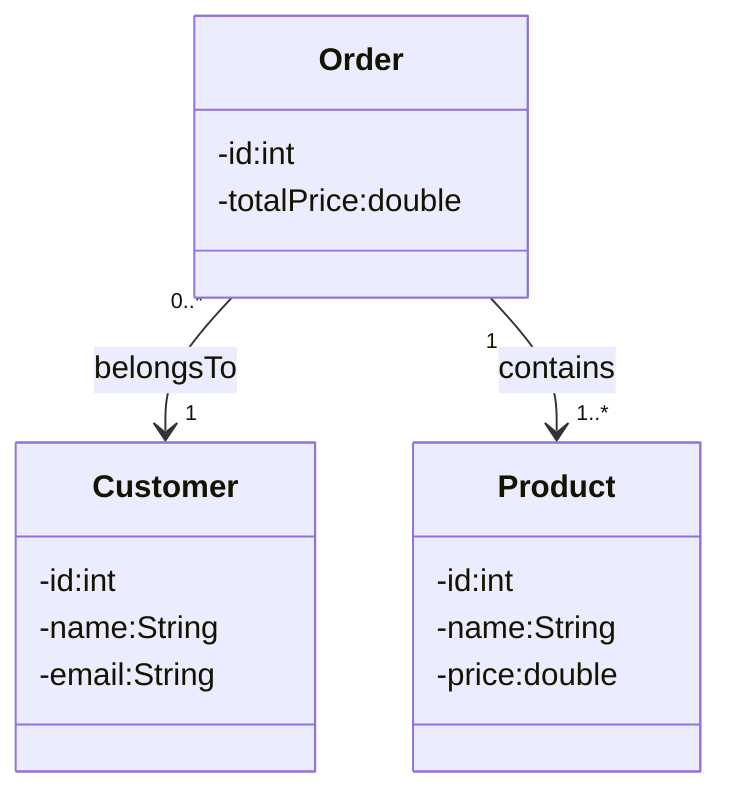

Consolbased onlineshop contains the following classes:
Customer, Product, Order and App

✅ Customer
- Fields: id, name, email
- No order history
- No relationship to products
- Only stored in a list inside App
- 
- 
  ✅ Product
- Fields: id, name, price
- No category
- No catalog
- Created manually each time
- 
- 
  ✅ Order
- Fields: id, customer, list of products
- No date
- No status
- No connection back to the customer
- Only one order existed at a time
- 
- 
  ✅ App
- Did everything:
- Created customers
- Created orders
- Created products
- Printed results
- Handled user input

gonna try add the optional task to 
- Add one or more classes **or** new fields/methods
- Add relationships that make sense in the scenario
- Explain your design choices:
    - What you added
    - Why you added it
    - How it improves the system